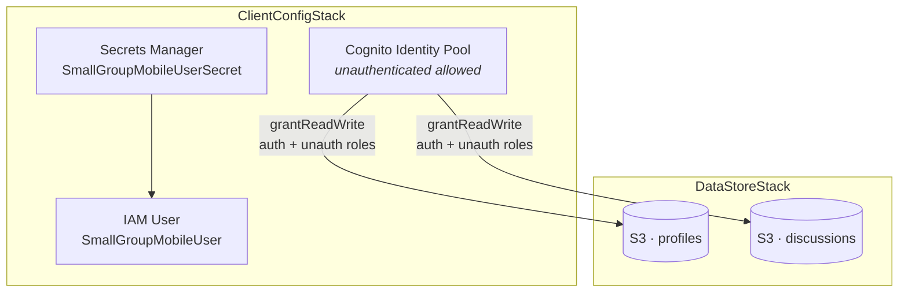

# Small Group CDK

The AWS infrastructure behind [small-group-mobile](https://github.com/2016judea/small-group-mobile) —
two S3 buckets and a Cognito identity pool, and nothing else.

There is no API tier here on purpose. The mobile client gets temporary credentials
from Cognito and talks to S3 directly, so the entire backend is storage plus the
IAM roles that gate it.

## The two stacks



`ClientConfigStack` owns identity and exports the pool; `DataStoreStack` takes that
pool as a prop and grants its roles onto the buckets. The dependency runs one way,
so identity can deploy without storage but not the reverse.

Bucket names are suffixed with stage and region — `small-group-profiles-prod-us-east-1` —
so a second stage is additive rather than a conflict.

## Stages

`StageConfiguration.ts` defines the shape (`env` × `region` × `accountId`) and
exports the list `App.ts` iterates. Only `prod / us-east-1` is wired up; the
`BETA` and `GAMMA` enum members exist but aren't in the `stages` array. Adding a
pre-prod stage means one more entry there, and both stacks get built for it.

## Layout

```
lib/
├── App.ts                  # entry — builds both stacks per stage
├── ClientConfigStack.ts    # secret, IAM user, identity pool
├── DataStoreStack.ts       # the two buckets + role grants
└── StageConfiguration.ts   # stage definitions
```

Built on `monocdk` — the single-package distribution of CDK v1.

## Deploying

```bash
npm run config:deploy    # configure AWS CLI credentials
npm run build
npm run deploy
```

Then copy the bucket names and identity pool id into the mobile app's
`config/awsConfig.ts`.

## Status

**Archival**, and worth two warnings before anyone lifts this:

- **`monocdk` is end-of-life.** CDK v1 reached end of support in June 2023.
  A rewrite against `aws-cdk-lib` v2 is mostly mechanical import changes.
- **The permissions are prototype-grade.** `allowUnauthenticatedIdentities: true`
  combined with `grantReadWrite` to the *unauthenticated* role means anyone holding
  the identity pool id can read and write every bucket object. The code marks this
  `temporarily`, pending an auth story that was never finished. The CORS rule is
  `*` for the same reason.
